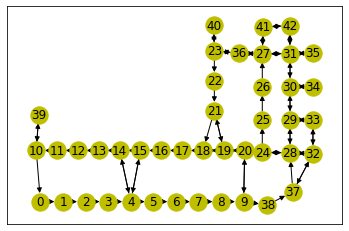
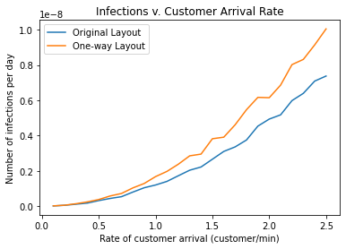

# Investigating COVID-19 Transmission in Supermarkets

By: Rebecca Flach and Daniel Quinteros

## Abstract
Our study replicates and extends previous research on COVID-19 transmission in supermarkets using an agent-based model. We analyze factors such as customer mobility, virus transmission, and intervention strategies to mitigate the spread. Results suggest that controlling customer arrival rates and implementing face mask policies significantly reduce infections. However, the model has limitations, including simplified infection mechanisms and synthetic paths.

## Methodology

The following contents of the methodology section replicates the research conducted in [**Modeling COVID-19 transmission in supermarkets using an agent-based model**](https://www.semanticscholar.org/reader/17a2627fca7585df99f9d214831992a3756ed772) [1], where the authors propose an agent-based model to calculate total exposure time, representing the duration customers spend near infected individuals, and estimate infection rates using a basic transmission model in order to offer insights into mitigating the spread of COVID-19.

#### Store Graph

Supermarket layouts are depicted as networks, where nodes correspond to different zones categorized into four types: entrance, exit, till, and shelf.

**Figure 1: Store network visualization**, with the nodes defined by:
| Zone Type | Node(s) |
| -------- | ------- |
| Entrance | 39, 40, 41 |
| Till | 33, 34, 35 |
| Exit | 42 |
| Shelf | All other undefined nodes |

#### Customer Mobility

Customers enter the store at a constant arrival rate λ, starting from the entrance node. Each customer is assigned a random path through the supermarket from a set of paths generated using synthetic data. At each node along their path, customers pause for a random duration T, representing the time spent selecting items from the shelf. After this waiting period, customers proceed to the next node in their path. Upon reaching the exit node, customers are removed from the simulation.

#### Virus Transmission

Upon entering the store, customers are either infectious or susceptible. The proportion of infectious customers is determined by probability p. Furthermore, the virus transmission rate is denoted by β. We assume that susceptible customers become infected in proportion to their total exposure time E, defined as the cumulative duration during which susceptible customers are in the same zone as infectious customers. Consequently, the number of infections is given by the transmission rate β multiplied by the total exposure time E.

For our initial simulation, our default parameters are as follows:
| Parameter | Default value |
| -------- | ------- |
| Arrival rate (λ) | 2.55 customer/min |
| Mean wait time at each node (τ) | 0.2 min |
| Percentage of infected customers (p) | 0.11% |
| Transmission rate (β) | 1.41e-9 per min |
| Length of opening hours (H) | 14 hours |

After running 1000 simulations, each simulating a day in the synthetic store, our results provided us with the following metric:
| Metric | Mean |
| -------- | ------- |
| Total exposure time | 5.84 min |

With the total exposure time averaging 5.84 min/day, and the transmission rate β = 1.41e-9 per min, we can multiply the two to find the average number of infections per day.
| Metric | Mean |
| -------- | ------- |
| Number of Infections (per day) | 8.23e-9 |

Additionally, our model allows us to log the mean exposure time in each zone. From this heatmap, we can investigate any possible 'hotspots' that could be mitigated.

**Figure 2: Store network heatmap visualization** based on mean exposure time in each zone. The color ranges from black to bright red. The brighter the red, the higher the average exposure time is in that zone.

Following this, we explore some common COVID-19 exposure interventions such as:

* Controlling the rate of customer arrival
    * We perform a parameter sweep, varying the rate at which customers enter the store from 0 to 2.5 customers/min.

* Restricting maximum number of customers in the store
    * We perform a parameter sweep, varying the maximum store capacity from 1 to 30 customers.

* Face masks
    * We implement a face mask policy by reducing the transmission rate. In this case, we multiply the transmission rate by a factor of 0.17.

* One-way aisle layout
    * We change the store graph to a directed graph, where some edges are uni-directional. 

## Results

### Customer Arrival Rate

**Figure 3: Infections v. Customer Arrival Rate**, representing the relationship between the average number of infections per day vs. the rate at which customers enter the store. We perform a parameter sweep to investigate the impacts of changing the arrival rate, ranging from 0.1 to 2.5. The remaining parameters are set to their default values.

### Store Maximum Capacity

**Figure 4: Infections v. Maximum Capacity**, representing the relationship between the average number of infections per day vs. the maximum number of customers allowed in the store. We perform a parameter sweep to investigate the impacts of changing the maximum capacity in the store, ranging from 1 to 30. The remaining parameters are set to their default values.

### Face Masks

We implement a face mask policy by reducing the transmission rate via scaling by a 'relative transmission risk reduction' factor RRR = 0.17. This decreases the number of average daily infections from 8.23e-9 to 1.4e-9.

| Metric | Mean |
| -------- | ------- |
| Number of Infections (per day) | 1.4e-9 |

### One-way Aisle Layout

We implement a one-way aisle layout by changing the store graph to a directed graph, where some edges are uni-directional.

**Figure 5: One-way Store Layout**, showing how the graph of the store looks with some aisles being designated as one-way only. 

We vary the arrival rate with this new store setup, and get the following results. 

**Figure 6: Infections v. Customer Arrival Rate with One-way Layout**, representing the relationship between the average number of infections per day vs. the rate at which customers enter the store, in both the original store layout and a modified one-way version of that store.

## Interpretation

Our original simulation without COVID-19 exposure interventions shows an average of 8.23e-9 infections per day.

When we try to decrease COVID-19 exposure by regulating customer arrival rates, we observe that the number of infections per day increases quadratically with the rate at which customers enter the store. This relationship is intuitive: lower customer arrival rates correspond to reduced average exposure time and infections.

In attempting to reduce COVID-19 exposure by controlling the maximum store capacity, we find that the number of infections per day is quadratically proportional to the maximum number of customers allowed in the store until it reaches a maximum capacity of about 15. At this point, it levels off to approximately our original rate of 8.23e-9 infections per day. Upon closer examination of our initial simulation, we note that the store typically accommodated around 15 customers at any given time. With this insight, we have two options: maintain the maximum capacity below the current average of 15 customers or allow it to exceed 15 customers, as the model suggests no increase in infections beyond this point.

When we implement a one way layout, we find that it actually increases the number of infections. This is likely due to the fact that this increases the total amount of time spent in the store by making less efficient paths to necessary items. It is possible that a more carefully planned one way store plan could have a positive impact, but this result shows that attempting this is generally not advisible and could have a negative impact. 

Implementing a face mask policy to reduce COVID-19 exposure results in a decrease in infections by a factor of 0.17. This reduces the number of average daily infections from 8.23e-9 to 1.4e-9. Based on our current findings, this approach appears to be the simplest to implement while significantly reducing daily infections, allowing the same number of customers to shop.

## Extension

For our extension, we adapt the model to simulate the same experiments within the dining hall of Olin College of Engineering.

**Figure 7: Olin dining hall network visualization**, with the nodes defined by:
| Zone Type | Node(s) |
| -------- | ------- |
| Entrance | 0 |
| Till | 8, 11 |
| Exit | 12 |
| Shelf | All other undefined nodes |

At the dining hall, the "zone types" can be understood as follows: The entrance serves as the point where students swipe in to gain access. The tills refer to the soda machine and silverware stations. The exit denotes the area where people leave the dining hall. Lastly, the "shelves" designate spaces where food is displayed.

For our initial simulation, we maintained the default parameters utilized in the initial simulation of the store network, with the exception of adjusting the hours of operation to fit the dining hall's schedule. After running 1000 simulations, each simulating a day in the dining hall, our results provided us with the following metric:
| Metric | Mean |
| -------- | ------- |
| Total exposure time | 2.97 min |

With the total exposure time averaging 2.97 min/day, and the transmission rate β = 1.41e-9 per min, we can multiply the two to find the average number of infections per day.
| Metric | Mean |
| -------- | ------- |
| Number of Infections (per day) | 4.19e-09 |

Additionally, our model allows us to log the mean exposure time in each zone. From this heatmap, we can investigate any possible 'hotspots' that could be mitigated.

**Figure 8: Olin dining hall heatmap visualization** based on mean exposure time in each zone. The color ranges from black to bright red. The brighter the red, the higher the average exposure time is in that zone.

Following this, we explored the same common COVID-19 exposure interventions:

* Controlling the rate of customer arrival
* Restricting maximum number of customers in the store
* Face masks
* One-way aisle layout 

### Dining Hall Maximum Capacity

**Figure 9: Infections v. Maximum Capacity**, representing the relationship between the average number of infections per day vs. the maximum number of students allowed in the dining hall. We perform a parameter sweep to investigate the impacts of changing the maximum capacity in the dining hall, ranging from 1 to 30. The remaining parameters are set to their default values.

At maximum restrictions, limiting the number of people in the food area is highly effective at limiting infections. However, above ten people, the effect is negligible. 

## Limitations

Our replication and extensions may offer insights into mitigating the spread of COVID-19. However, it's important to note that like all models concerning health and medical safety, it should not be considered definitive. This model has limitations, such as the use of synthetic pre-generated paths, the basic infection mechanism relying on exposure time, the constant arrival rate, and other factors. In particular, this original model was created in the early pandemic, using a primitive understanding of the spread of COVID-19, and does not take into account the differences in the current variants of COVID-19. 

## Annotated Bibliography
[1] [**Modeling COVID-19 transmission in supermarkets using an agent-based model**](https://www.semanticscholar.org/reader/17a2627fca7585df99f9d214831992a3756ed772) by Fabian Ying, Neave O’Clery

In this paper, the authors investigate how COVID-19 is transmitted within a supermarket and use their model to determine the most effective interventions to decrease spread. In their primary experiment, they model a small supermarket using a graph, where each node is a place where a customer would stop and interact with the shelves, register, or other important points. They then create agents to represent customers, each with a random path through the store and time spent at each location. Infection risk is estimated by the amount of time a susceptible agent spends in proximity to an infected agent. They find that transmission risk is increased by bottleneck points, like the registers, and that limiting the number of customers in the store is an effective way to reduce transmission.
